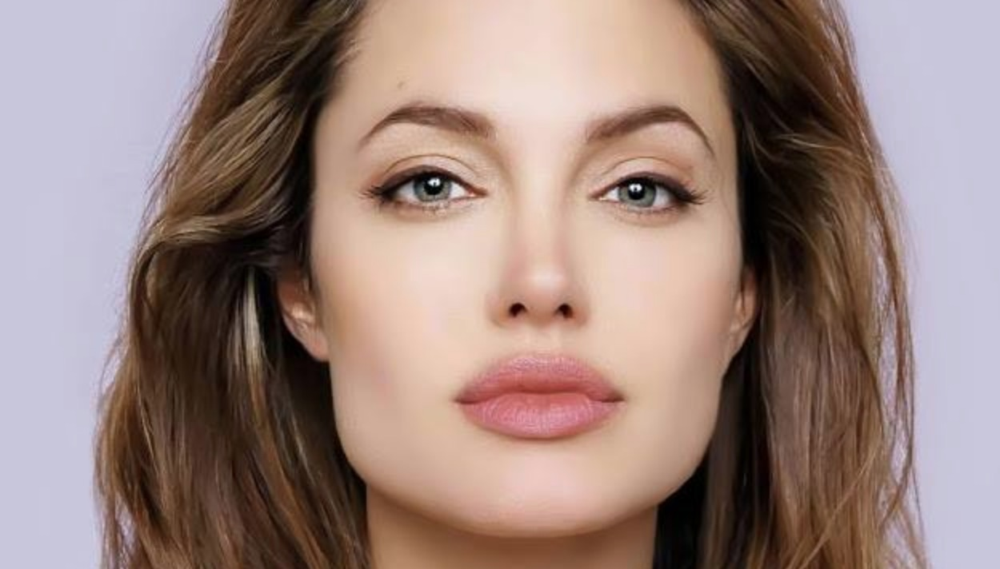
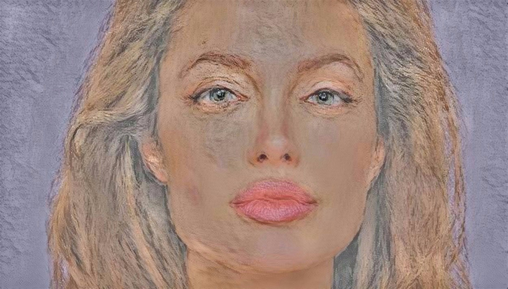

.. vim: set fileencoding=utf-8 :

===============
 Style Transfer
===============

We have implemented the style transfer strategy from::

    Gatys, Leon A., Alexander S. Ecker, and Matthias Bethge. "A neural algorithm of artistic style." arXiv preprint arXiv:1508.06576 (2015).

Check as the usage possibilities with the command::

 $ bob tf style_transfer --help

Here we have an example on how to do a style transfer using VGG 19 trained with the image net

.. doctest::

    >>> from bob.learn.tensorflow.network import vgg_19
    >>> # --architecture
    >>> architecture = vgg_19

    >>> import numpy

    >>> # YOU CAN DOWNLOAD THE CHECKPOINTS FROM HERE
    >>> # https://github.com/tensorflow/models/tree/master/research/slim#pre-trained-models
    >>> checkpoint_dir = "[DOWNLOAD_YOUR_MODEL]"

    >>> # --style-end-points and -- content-end-points
    >>> content_end_points = ['vgg_19/conv4/conv4_2', 'vgg_19/conv5/conv5_2']
    >>> style_end_points = ['vgg_19/conv1/conv1_2',
    ...                 'vgg_19/conv2/conv2_1',
    ...                 'vgg_19/conv3/conv3_1',
    ...                 'vgg_19/conv4/conv4_1',
    ...                 'vgg_19/conv5/conv5_1'
    ...                ]

    >>> # Transfering variables
    >>> scopes = {"vgg_19/":"vgg_19/"}

    >>> # Set if images using
    >>> style_image_paths = ["vincent_van_gogh.jpg"]

    >>> # Functions used to preprocess the input signal and
    >>> # --preprocess-fn and --un-preprocess-fn
    >>> # Taken from VGG19
    >>> def mean_norm(tensor):
    ...     return tensor - numpy.array([ 123.68 ,  116.779,  103.939])

    >>> def un_mean_norm(tensor):
    ...     return tensor + numpy.array([ 123.68 ,  116.779,  103.939])

    >>> preprocess_fn = mean_norm

    >>> un_preprocess_fn = un_mean_norm

Here we use an image from Angelina Jolie using Van Gogh style as an example::

   $ bob tf style_transfer angelina.jpg angelina_output.jpg vgg19_example.py -i 1000.

    Source (content) image

.. figure:: img/vincent_van_gogh.jpg
    :width: 27%

    Style image

    Generated image

